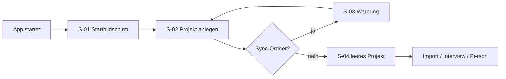
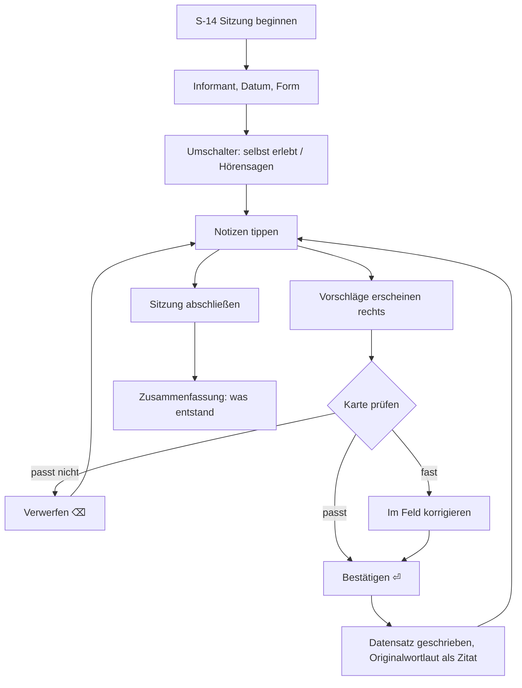
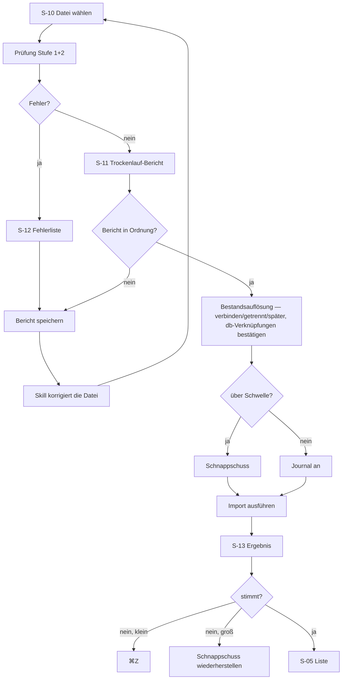
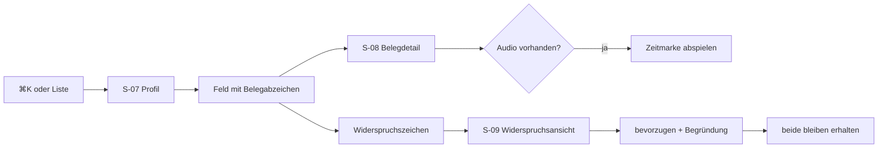
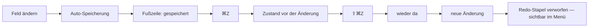
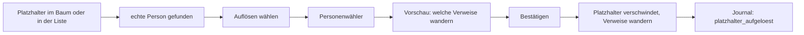

# Wurzelwerk — Bildschirme, Bedienkonzept und Abläufe

**Stand:** 24.08.2026 · **Grundlage:** `70_UX_Konzept.md`, `71_Designsystem.md`,
`57_Phase0_Arbeitspakete.md`, `56_Import_Vertrag.md`
**Zweck:** Die vollständige Bildschirmliste für den Prototyp, jeder mit Zweck, Aufbau,
Komponenten und Zuständen. Dazu die Abläufe und die Tastaturkarte.

---

## 0. Zwei Stufen, ein Designsystem

Der Prototyp deckt alle Ansichten bis Phase 5 ab. Damit das nicht zur Planung von Phase 3 wird,
gilt eine klare Abstufung:

| Stufe | Umfang | Anspruch |
|---|---|---|
| **Stufe 1** — S-01 bis S-23 | alles aus Phase 0 und Phase 1 | **Verbindlich und detailliert.** Alle Zustände entworfen, beide Themen, beide Dichten. Das wird gebaut. |
| **Stufe 2** — S-24 bis S-34 | Baum, Karte, Zeitleiste, Zusammenführung, medizinische Ansicht, Netzwerk | **Zielbild.** Ein Zustand je Bildschirm, keine Randfälle. Zweck ist der Härtetest des Designsystems, nicht die Feinplanung. |

**Warum Stufe 2 trotzdem gebraucht wird:** Die Baumansicht ist die anspruchsvollste Ansicht des
Produkts, und sie stellt genau die Fragen, die ein Tokensystem entweder beantwortet oder nicht —
verträgt die Konfidenzpalette 2.000 kleine Flächen nebeneinander, funktioniert die Datenebenen-Legende,
bleibt die Personenkarte in vier Dichtestufen lesbar. Ein Designsystem, das nur an Formularen
entworfen wurde, bricht dort. Deshalb: Stufe 2 wird entworfen, aber nicht ausgearbeitet.

**Was Stufe 2 ausdrücklich nicht heißt:** dass Phase 2 oder 3 damit geplant wären. Die
Arbeitspakete in `57_Phase0_Arbeitspakete.md` bleiben unverändert. `10_Vision_Scope.md` §5
warnt vor dem Reflex, eine Phase „erst noch vollständig" zu machen — ein Entwurf ist keine Phase.

---

## 1. Das Fenstergerüst

Alle Hauptansichten laufen im selben Gerüst (`T-Shell` aus `71_Designsystem.md` §2.4). Es wird
**einmal** entworfen und danach nur noch gefüllt.

```
┌───────────────────────────────────────────────────────────────────────────────┐
│  KOPFZEILE                                                                    │
│  ⌕ Suche…        Zentrum: Erna Wruck ▾    [Baum|Liste|Karte|…]   Zeit ────●── │
├──────────────┬──────────────────────────────────────────────┬─────────────────┤
│              │                                              │                 │
│  NAVIGATION  │            ARBEITSBEREICH                    │   DETAIL        │
│              │                                              │                 │
│  Ansichten   │   die eine Frage, die diese Ansicht          │   Auswahl:      │
│  Filter      │   beantwortet                                │   Person /      │
│  Gespeichert │                                              │   Ereignis /    │
│              │                                              │   Ort / Quelle  │
│              │                                              │                 │
├──────────────┴──────────────────────────────────────────────┴─────────────────┤
│  FUSSZEILE   ● gespeichert · 1.284 Personen · ⚠ 7 Prüfhinweise               │
└───────────────────────────────────────────────────────────────────────────────┘
```

**Regeln für das Gerüst:**

- Beide Seitenleisten sind einklappbar. Eingeklappt bleibt eine Symbolspalte, nicht nichts — sonst findet man den Weg zurück nicht.
- Die Kopfzeile ist **eine** Zeile hoch. Der Zeitregler erscheint nur in Ansichten, in denen er wirkt (Baum, Karte, Zeitleiste, Profil) — er verschwindet nicht, er wird gesperrt und erklärt sich beim Überfahren. Ein Element, das kommt und geht, verschiebt das Layout.
- Der Arbeitsbereich hat **keinen** Rahmen und keinen Schatten. Er ist die Bühne (§10 Prinzip 1).
- Die Fußzeile ist der Ort für Zustand, nie für Aktionen. Ihre drei Anzeigen sind alle anklickbar und öffnen jeweils eine Ansicht.
- Fenstersteuerung, Menüleiste und Systemdialoge folgen der Plattform (ADR-013). Alles im Fenster ist eigenes Design.

**Mindestfenstergröße:** 1024 × 700. Darunter klappen beide Seitenleisten automatisch ein.
Bei 1440 × 900 (Entwurfsgröße) sind beide offen.

---

## 2. Stufe 1 — Phase 0 und 1

### S-01 · Startbildschirm

**Frage:** Welches Projekt öffne ich?
**Template:** `T-Leer` · **Zustand:** kein Projekt geöffnet, kein Shell

Zentrierte Spalte: Wortmarke, „Neues Projekt", „Projekt öffnen…", darunter die Liste der zuletzt
geöffneten Projekte mit Pfad, Personenzahl und letztem Öffnen. Ein Projekt, dessen Ordner
verschwunden ist, steht ausgegraut mit „nicht gefunden" da und ist entfernbar — es wird nicht
still weggelassen.

**Zustände:** erster Start (keine Liste, nur die zwei Aktionen) · mit Liste · Projekt nicht
gefunden · lädt.

### S-02 · Projekt anlegen

**Template:** `T-Dialog` schmal
Felder: Projektname (Textfeld) · Speicherort (Ordnerwahl über Systemdialog) · Vorschau des
entstehenden Pfades `…/MeinStammbaum.ahnen`.
**Zustände:** leer · gültig · Name existiert schon · Zielordner nicht schreibbar.

### S-03 · Sync-Ordner-Warnung

**Template:** `T-Dialog` schmal · **Auslöser:** Pfad unter Dropbox, iCloud Drive oder OneDrive

Warnung nach ADR-002, mit dem konkreten Grund (SQLite kann in Sync-Ordnern beschädigt werden)
und zwei Wegen: anderen Ort wählen (bevorzugt) oder trotzdem öffnen. **Der gefährliche Weg ist
nicht der voreingestellte**, aber er ist auch nicht versteckt — der Nutzer entscheidet über seine
eigenen Daten.

### S-04 · Leeres Projekt

**Frage:** Wie fange ich an?
**Template:** `T-Shell` mit `LeerzustandBlock` im Arbeitsbereich

Drei Wege, gleichrangig angeboten: **Importdatei einlesen** (der Hauptweg nach ADR-010) ·
**Interview beginnen** · **Person anlegen**. Dazu ein Satz, der sagt, warum der Import der
schnellste Weg ist.

Dieser Bildschirm ist wichtiger, als er aussieht: Er ist der erste Eindruck, und er entscheidet,
ob der Nutzer die Erfassungsstrecke findet, die für ihn gebaut wurde.

### S-05 · Listenansicht

**Frage:** Wo ist Person X? Wer erfüllt Kriterium Y?
**Organismus:** `Datentabelle` · **Anforderung:** C-16

Spalten (wählbar): Name · Lebensdaten · Geburtsort · Beruf · Konfidenz · Belege · Kinderzahl ·
benutzerdefinierte Felder. Sortierung über Suchnormalform (`Müller` vor `Mueller` vor `Nagel`).
Filterleiste links: Platzhalter, `privat`, Konfidenzstufe, „hat Widerspruch", Zeitraum, Ort,
Strang.

**Zwingend zu entwerfen:**
- Platzhalterzeilen sind **gestrichelt umrandet, ohne Namen** (A-17) und sofort als solche erkennbar
- Konfidenzspalte zeigt `KonfidenzPunkt` plus `WiderspruchZeichen`, getrennt
- eine Zeile mit kyrillischem Original **und** Umschrift: `Щербаков · Ščerbakov`
- eine Zeile mit unscharfem Datum: `etwa 1890 – 1961`

**Zustände:** gefüllt komfortabel · gefüllt kompakt · leer (kein Projekt-Inhalt) · leer (Filter
ohne Treffer, mit „Filter zurücksetzen") · lädt · Fehler · 2.000 Zeilen (Scrollverhalten).

### S-06 · Befehlspalette

**Auslöser:** ⌘K / Ctrl+K · **Anforderung:** A-13, 70_UX §7
**Template:** Überlagerung, oben zentriert

Ein Feld, darunter gruppierte Treffer: **Personen** (mit Lebensdaten und Konfidenz) ·
**Aktionen** („Person anlegen", „Importieren", „Interview beginnen", „Rückgängig") ·
**Orte** · **Quellen** · **Ansichten**. Tastenkürzel stehen rechts an jeder Aktion — so lernt man
sie, ohne sie zu lernen.

**Zustände:** leer mit den häufigsten Aktionen · tippend mit Treffern · kein Treffer (mit
„… als neue Person anlegen") · Suche über Schriftsysteme (`Scerbakov` findet `Щербаков`).

### S-07 · Profilseite

**Frage:** Wer war dieser Mensch?
**Template:** `T-Vollseite` — Überlagerung, der Kontext bleibt darunter sichtbar (70_UX §2)
**Anforderung:** C-04

Aufbau von oben:
1. `Profilkopf` — bevorzugter Name groß, weitere Namen darunter mit Typ, Lebensdaten, Titelbild, Gesamt-Konfidenzlage
2. **Grunddaten** — Feldliste, jedes Feld mit `KonfidenzPunkt` und `Belegabzeichen`
3. `EreignisZeitstrahl` — chronologisch, mit Rollen; optional Ereignisse naher Verwandter als Kontext (C-15)
4. `Beziehungsliste` — Eltern, Partner, Kinder, Geschwister; an **jeder** Stelle „hinzufügen"
5. **Weitere Felder** — benutzerdefinierte Felder, gruppiert nach `feld_definition.gruppe`
6. `GesundheitsBlock` — mit festem, nicht ausblendbarem Exportsperrhinweis (M-08)
7. **Medien**
8. **Notiz**

**Adaptiver Umfang (C-04):** Leere Abschnitte erscheinen nicht. Eine Person mit einem Namen und
einem Geburtsjahr ergibt eine kurze, ruhige Seite — nicht ein Formular voller leerer Felder. Das
ist zu entwerfen: **derselbe Bildschirm mit einer datenarmen und einer datenreichen Person.**

**Zustände:** datenarm (nur Name, Konfidenz 2) · datenreich (Karl Friedrich Gutnoff, vollständig)
· Platzhalter · lebende Person mit `privat`-Kennzeichnung · mit Widerspruch · lädt · nicht
gefunden.

### S-08 · Belegdetail

**Auslöser:** Klick auf `Belegabzeichen` · **Anforderung:** B-01, B-02
**Als Popover** bei einem Beleg, **als Seitenschublade** bei mehreren.

Dreistufig sichtbar: **Quelle** (Titel, Typ, Archiv, Signatur) → **Zitat** (Seite,
Eintragsnummer, Zugriffsdatum, Digitalisat) → **Transkript** in `--wz-familie-original`.
Bei mündlichen Quellen zusätzlich: Informant (verlinkt auf seine Person), Gesprächsdatum,
`unmittelbarkeit` als Abzeichen („selbst erlebt" / „vom Hörensagen"), und wenn vorhanden eine
`AudioZeitmarke` zum Nachhören.

Die `unmittelbarkeit` ist hier prominent, weil sie genealogisch der wichtigste Unterschied ist
(`56_Import_Vertrag.md` §3.2) — und weil man sie im Datenmodell erhoben hat, um sie zu sehen.

### S-09 · Widerspruchsansicht

**Auslöser:** Klick auf `WiderspruchZeichen` · **Anforderung:** B-04, E21
**Organismus:** `Widerspruchsblock`

Alle konkurrierenden Aussagen zum gleichen Prädikat nebeneinander. Je Aussage: Wert, Konfidenz,
Beleg, Originaltext. Die bevorzugte ist hervorgehoben und trägt ihre `begruendung` als
Fließtext. Aktionen: eine andere bevorzugen (verlangt eine Begründung) · beide stehen lassen ·
eine als falsch markieren.

**Der Prüfstein:** Augusts zwei Todesdaten aus `beispiel-2-widersprueche.json` — Grabstein 1961
(Konfidenz 3, bevorzugt, „der Grabstein ist die stärkere Quelle") gegen Ernas „58 oder 59"
(Konfidenz 2). Dieser Bildschirm muss zeigen, dass **beide Angaben Bestand haben** und keine
gelöscht wurde. Das ist Leitprinzip 1 in Bildform.

### S-10 · Import: Datei wählen

**Template:** `T-Assistent`, Schritt 1 von 3
Ablagefeld für die Datei, Erklärung des Vertrags, Verweis auf den Skill, und die Liste der
letzten Importe mit ihrer Prüfsumme — damit ein doppelter Import auffällt, bevor er beginnt.

**S-10 · Erweiterung (06.09.2026): Bestandsauszug für den Skill (D-14)**

Neben der Dateiwahl eine Aktion **„Bestandsauszug für den Skill erzeugen"** (auch über die Befehlspalette): exportiert die kompakte, lesende Personenliste (uuid, bevorzugter Name, Lebensjahre, direkte Eltern/Partner), die der Skill braucht, um beim Auswerten `db:`-Referenzen auf schon vorhandene Personen zu setzen — statt alles als `tmp:` neu anzulegen. Read-only, **keine Gesundheitsdaten** (M-08). Der Auszug ist die Voraussetzung dafür, dass „der Vater ist der Walter, den du schon hast" beim Import verbindet statt dupliziert.

### S-11 · Import: Trockenlauf-Bericht

**Template:** `T-Assistent`, Schritt 2 · **Organismus:** `TrockenlaufBericht`
**Referenz:** `56_Import_Vertrag.md` §6.2 — **die sieben Blöcke in genau dieser Reihenfolge**

1. **Zusammenfassung** mit der **Art der Rücknahme** ganz oben — einzelner Undo-Schritt oder Schnappschuss (ADR-019). Das ist die Information, die der Nutzer für seine Entscheidung braucht, und sie steht deshalb nicht unten.
2. **Wird angelegt** — nach Entität gruppiert, mit Namen
3. **Wird ergänzt** — **jede einzelne Änderung**, nicht eine Anzahl; mit dem Satz „keine bestehenden bevorzugten Werte werden ersetzt" oder, bei `ueberschreiben`, der Liste der Ersetzungen mit alt und neu, farblich abgesetzt
4. **Mögliche Dubletten** — mit Punktwert **und** Begründung, plus dem Hinweis, dass getrennt angelegt wird
5. **Fehler** — mit IMP-Code, JSON-Pfad, Zeile, „Was tun"
6. **Hinweise** — dieselbe Form, andere Gewichtung
7. **Nicht verarbeitetes Material** — **immer sichtbar, auch wenn leer.** Ein leerer Block bei einem langen Gespräch ist ein Warnsignal (§7.3 des Importvertrags)
8. **Gesundheitsdaten** — mit dem Exportsperrvermerk, jedes Mal

Fuß: „Importieren" (gesperrt bei Fehlern > 0) · „Bericht als Text speichern" (der Rückweg zum
Skill) · „Abbrechen".

**Dieser Bildschirm ist der zweitwichtigste des Produkts** — nach dem Interview-Modus. Er ist
das, was man in Phase 1 am häufigsten liest. Er muss lang sein dürfen, ohne unübersichtlich zu
werden: klare Blockgrenzen, Zähler an jedem Block, Sprungmarken.

**Zustände:** alles grün · mit Fehlern · mit vielen Hinweisen (40+) · leerer Notizblock (mit
Warnung) · doppelte Prüfsumme · großer Import über der Schwelle · lädt.

**S-11 · Erweiterung (06.09.2026): Personensicht und Bestandsauflösung (D-14/D-15)**

Drei Ergänzungen am zweitwichtigsten Bildschirm. Sie ändern die acht Blöcke oben nicht, sie legen sich darüber.

1. **Umschaltbare Sicht — nach Entität / nach Person.** Zusätzlich zur bestehenden Gruppierung (Wird angelegt / Wird ergänzt / …) eine personenweise Ansicht: pro betroffener Person eine Karte mit „neu · ergänzt · im Konflikt", damit man den Import so liest, wie man ihn denkt („was passiert mit Erna?"). Gleiche Datengrundlage (die `aenderung`-Zeilen), nur andere Gruppierung. Vorgabe bleibt die Entitätssicht; die Personensicht ist ein Umschalter in der Berichtskopfzeile.

2. **Konflikt-Variante direkt im Bericht wählbar.** Bisher blieb bei konkurrierenden Werten die Zweitaussage stehen und wurde erst in S-09 aufgelöst. Neu: an einer Konfliktzeile direkt „bevorzugen: A / B / beide behalten" — mit Begründungspflicht wie in S-09. **„Beide behalten" bleibt gleichrangige Vorgabe** (das Modell kann Widersprüche, B-04). Wer nichts entscheidet, bekommt das heutige Verhalten: beide bleiben, Auflösung später.

3. **Bestandsauflösung — der aktive Ersatz für „Mögliche Dubletten" (D-15).** Der Block „Mögliche Dubletten" wird von einer Anzeige zu einer Entscheidung. Für jede `tmp:`-Person mit einem Bestandstreffer (Name phonetisch + Datum + **relationaler Kontext** — „soll Vater von db:Erna sein; Erna hat schon einen Vater Walter") zeigt der Bericht den Kandidaten mit Punktwert und Begründung und drei Wege:
   - **Verbinden** — die `tmp:`-Person wird als die vorhandene behandelt; Fakten wandern an sie (Ergänzungspfad wie `db:`), Kanten zeigen auf sie.
   - **Getrennt anlegen** — heutiges Verhalten, im Zweifel die Vorgabe.
   - **Später entscheiden** — anlegen + als Dublett markiert.
   „Verbinden" ist die Oberflächenform von „der Vater von A ist B → verbunden" — aber als bestätigte, umkehrbare Wahl, **nie automatisch** (W-05). Es ist kein volles Merge-Modal (D-04/S-30): es hängt an eine vorhandene Person an, den Pfad gibt es schon.

4. **KI-gesetzte `db:`-Verknüpfungen sind bestätigungspflichtig.** Enthält die Datei schon `db:`-Referenzen (weil der Skill den Bestandsauszug D-14 hatte), erscheint jede als eigene, abhakbare Zeile — „neues Material hängt an: Erna Wruck (db:…)". Eine falsche, aber existierende `uuid` ist schlimmer als ein falsches Feld; deshalb wird sie gezeigt, nicht blind ausgeführt. Das ist die einzige Stelle, an der der Vertrag heute zu gutgläubig war (IMP-202 prüft nur, *ob* die Kennung existiert, nicht *ob sie stimmt*).

**Zusätzlich zu entwerfende Zustände:** Auflösungskandidat mit drei Optionen · Konfliktzeile mit Variantenwahl · Personensicht (eine Person, gemischt neu/ergänzt/Konflikt) · bestätigungspflichtige `db:`-Zeile.

### S-12 · Import: Fehlerliste

**Organismus:** `FehlerlisteImport` · **Referenz:** `56_Import_Vertrag.md` §5

Je Eintrag die fünf Bestandteile: Schweregrad und Code · JSON-Pfad · betroffene Kennung ·
Datei und Zeile · „Was tun" mit **allen** Auswegen. Gruppierbar nach Code oder nach Ort in der
Datei. Ein Klick zeigt die Stelle im Rohtext mit Kontext.

**Der Anspruch:** Eine Datei mit 40 Meldungen darf nicht resignieren lassen. Deshalb Gruppierung
nach Code — 30 mal IMP-206 ist ein Muster und eine einzige Korrektur, nicht 30 Probleme.

### S-13 · Import: Ergebnis

**Template:** `T-Assistent`, Schritt 3
Derselbe Bericht wie der Trockenlauf, jetzt als Vollzug, plus: „Rückgängig" (bei kleinem Import)
bzw. „Schnappschuss wiederherstellen" (bei großem, mit dem Hinweis, was dabei verloren geht) und
„Zur Liste".

Dass Trockenlauf und Ergebnis **gleich aussehen**, ist Absicht: Es ist die sichtbare Seite der
Invariante aus AP-1.5, dass beide Berichte identisch sind.

### S-14 · Interview-Modus

**Frage:** Wie halte ich ein Gespräch strukturiert und belegt fest?
**Organismus:** `InterviewZweispalter` · **Anforderung:** A-15 · **Referenz:** 70_UX §12

```
┌─ SITZUNG ────────────────────────────────────────────────────────────────────┐
│ Informant: Erna Wruck ▾   12.09.2026   Form: Audio ▾                         │
│ [ Selbsterlebtes │ Vom Hörensagen ]   ← setzt die Vorgabe-Konfidenz          │
│ ♪ 2026-09-12-erna-wruck.m4a  ──●──────── 00:14:22                            │
├──────────────────────────────────┬───────────────────────────────────────────┤
│ NOTIZEN (frei)                   │ ERKANNTE STRUKTUR                         │
│                                  │                                           │
│ Mein Vater, der Walter, der war  │  ┌ Person ─────────────── Vorschlag ─┐   │
│ Bergmann auf Zollverein. Der     │  │ Walter Wruck                       │   │
│ hatte die Staublunge, wie alle   │  │ „Mein Vater, der Walter"           │   │
│ da unten. Mit fünfundfünfzig     │  │ Konfidenz ●●●○   [Bestätigen ⏎]    │   │
│ ging nichts mehr.█               │  └────────────────────────────────────┘   │
│                                  │  ┌ Diagnose ───────────── Vorschlag ─┐   │
│                                  │  │ Staublunge · Atemwege · mit ~55    │   │
│                                  │  │ „hatte die Staublunge, wie alle…"  │   │
│                                  │  │ Konfidenz ●●○○   [Bestätigen ⏎]    │   │
│                                  │  └────────────────────────────────────┘   │
└──────────────────────────────────┴───────────────────────────────────────────┘
```

**Die fünf Regeln aus 70_UX §12, als Entwurfsauftrag:**

1. **Ein Vorschlag darf nie wie ein Datensatz aussehen.** Der Unterschied zwischen „grau" und „normal" muss auf einen Blick tragen — sonst ist die Regel „nichts wird ohne Bestätigung geschrieben" technisch erfüllt und praktisch gebrochen.
2. **Jede Karte trägt den Originalwortlaut** sichtbar mit, in `--wz-familie-original`. Nicht als Fußnote, nicht ausklappbar.
3. **Vorgabe für Datumsgenauigkeit ist „etwa"** — das Datumsfeld weiß, dass es hier steht.
4. **Widersprüche werden Konfliktkarten**, nicht Überschreibungen. Sagt Erna 1923 und Fritz 1925, stehen beide Werte da.
5. **Bestätigen mit einer Taste**, ohne Maus, ohne Dialog. Der Fokus wandert automatisch zur nächsten Karte.

**Zustände:** leer (Sitzung beginnt) · tippend mit Vorschlägen · Konfliktkarte · alles bestätigt ·
mit Audio und Zeitmarken · Umschalter auf „Vom Hörensagen" (sichtbar andere Vorgabe-Konfidenz) ·
kompakte Dichte (Vorgabe hier) · Sitzung abgeschlossen.

**Warum das der wichtigste Bildschirm ist:** Nach 70_UX §12 ist der Interview-Modus das einzige
Feature, dessen Fehlen unwiederbringliche Datenverluste verursacht. Ein Gespräch mit einer
88-jährigen Tante findet ein- oder zweimal statt.

**S-14 · Erweiterung (06.09.2026): Bestandsauflösung im Interview (D-15)**

Eine erkannte Struktur-Karte, deren Person schon im Baum steht, verweist auf diese vorhandene Person, statt eine zweite anzulegen. Die Karte trägt dann den bestätigungspflichtigen Zustand **„verbindet mit: Erna Wruck (db:…)"** — mit demselben relationalen Grund und denselben drei Wegen wie im Trockenlauf (verbinden / getrennt / später, D-15). So gilt „nichts wird ohne Bestätigung geschrieben" (§12 Regel 1) auch für die Verbindung, nicht nur für den Datensatz. Ohne Bestandsauszug (D-14) bleibt eine Karte im Zweifel `tmp:` und wird erst beim Import aufgelöst.

### S-15 · Prüfhinweise

**Organismus:** `Pruefhinweisliste` · **Anforderung:** F-07
Liste der Plausibilitätsfunde mit Regel, betroffenen Personen und Sprung dorthin. Jeder Hinweis
ist abhakbar („geprüft, ist korrekt so") und kommt dann nicht wieder — ohne das ist die Liste
nach dem dritten Import nur Rauschen. Abgehakte sind einblendbar.

**Zustände:** leer (der erfreuliche Fall, entwerfen!) · wenige · viele · nur abgehakte.

### S-16 · Änderungsverlauf

**Organismus:** `Aenderungsverlauf` · **Anforderung:** F-02
Transaktionen von neu nach alt, je mit Zeitpunkt, Beschreibung, Art (`nutzer` / `import` /
`wartung`) und Anzahl der Änderungen. Aufklappen zeigt die Feldänderungen mit alt und neu — die
aus den ganzen Zeilen berechnete Ansicht (ADR-017). Zurückgenommene sind als solche markiert,
nicht gelöscht. Nicht mehr rücknehmbare (aufgeräumtes Journal) sind erkennbar.

### S-17 · Wartung

Schnappschüsse (Liste mit Zeitpunkt, Größe, Anlass, Wiederherstellen) · „Datenbestand prüfen"
mit Bericht · „Abgeleitete Daten neu aufbauen" · Journalgröße und Aufräumen.
Ein technischer Bildschirm — er darf schmucklos sein, aber nicht unverständlich. Jede Aktion
sagt in einem Satz, was sie tut und was sie riskiert.

### S-18 · Einstellungen

Erscheinungsbild (hell / dunkel / Systemvorgabe · Dichte) · Sprache · Konfidenz-Vorgaben je
Quellenart · Schnappschuss-Häufigkeit · Import-Schwellwert · Tastenkürzel (Übersicht,
in Phase 1 nicht änderbar — „Tastenkürzel sind nach Einführung unantastbar", 70_UX §7).

### S-19 · Zustandsbibliothek

Ein eigenes Artboard, das **alle** Zustände einmal nebeneinander zeigt: Leerzustände (fünf
Varianten) · Ladezustände (Schimmer für Zeile, Block, Seite) · Fehlerzustände (Feld, Bereich,
Seite, IPC-Fehler) · „zu viele Daten" · „nicht gefunden" · Offlinezustand (entfällt — die App ist
immer offline, aber ein fehlender Kartenausschnitt ist der Analogfall).

Nach §10 Prinzip 4 sind Zustände Teil des Designs. Dieses Artboard ist der Beweis, dass sie
entworfen und nicht improvisiert wurden.

### S-20 · Person bearbeiten

**Template:** `Seitenschublade` oder `T-Vollseite` im Bearbeitungsmodus
**Zweiter Teil Phase 1** — aber im Prototyp gebraucht, weil hier **alle** Eingabefeldtypen
zusammenkommen.

Zu entwerfen als Feldsammlung: Textfeld · Langtext · Zahl · **Datumsfeld** in fünf Zuständen ·
**Zeitraumfeld** · **Ortsfeld** mit offener Vorschlagsliste · **Personenwähler** ·
Auswahlfeld · Mehrfachauswahl mit Chips · Umschalter · Kontrollkästchen · Optionsfeld ·
**Konfidenzwähler** · Medienwähler · URL-Feld · Kalenderwahl.

Jedes Feld in der Hülle `Formularfeld` mit Beschriftung, Hilfetext, Konfidenzwähler und
Belegabzeichen. **Kein Speichern-Knopf** (ADR-022, E29) — die Fußzeile zeigt den Speicherstatus.
Das ist zu entwerfen und wird Fragen aufwerfen: Ein Formular ohne Speichern-Knopf muss durch
seine Gestaltung vermitteln, dass es dennoch gespeichert ist.

### S-21 · Feld-Definitionssystem

**Anforderung:** A-18
Liste der Felddefinitionen mit Gruppe, Typ, Mehrfachwert, Zeitraumfähigkeit, „sensibel".
Anlegen-Dialog mit Typwahl und Vorschau, wie das Feld im Formular aussehen wird. Systemfelder
sind umbenennbar, nicht löschbar — sichtbar unterschieden.

Wichtig laut `50_Datenmodell.md` §2.13: Die Felder müssen in **Suche, Filter, Listenspalten und
Berichten** auftauchen. Der Bildschirm zeigt, wo ein Feld erscheint — „ein Feldsystem, dessen
Felder man nicht filtern kann, ist nur ein Notizzettel."

### S-22 · Gesundheitsmodul erfassen

**Anforderung:** M-01 bis M-04, M-08
Diagnose: Kategorie (11 Werte) · Organ (Pflicht bei Krebs) · Bezeichnung **im Wortlaut der
Quelle** · Erstdiagnose oder Alter · Status · Konfidenz · Beleg.
Risikofaktor: Art · Detail (Pflicht bei berufsbedingt) · Intensität · Zeitraum · Konfidenz.

**Zwei Dinge müssen im Entwurf sichtbar sein:**
1. Ein **fester, nicht ausblendbarer Hinweis**, dass diese Daten nie exportiert werden (M-08).
2. Ein Hinweis am Bezeichnungsfeld, dass der Wortlaut der Quelle gilt — „was mit dem Herzen" bleibt „was mit dem Herzen". Die Oberfläche darf nicht zur Präzisierung verleiten, die es nicht gibt.

### S-23 · Quellenansicht

**Frage:** Woher weiß ich das?
**Anforderung:** B-01, B-06, B-07
Dreistufiger Baum Quelle → Zitat → Aussage, dazu Archive und Negativbefunde. Bei mündlichen
Quellen die Interviewsitzungen als eigene Gruppierung — „alles, was aus dem Gespräch mit Tante
Erna vom 12.09.2026 stammt".

---

## 3. Stufe 2 — Zielbild späterer Phasen

### S-24 · Baum: Ahnentafel *(Phase 2)*

Der Bildschirm, an dem sich das Designsystem beweist. Zu zeigen: Personenkarten in
**Standarddichte**, Kanten in vier Formen (biologisch, adoptiv, Ehe, Scheidung),
Ein-/Ausklapppunkte, Zentrumsperson hervorgehoben, ein Platzhalter (gestrichelt, namenlos),
eine `DatenebenenWaehler`-Legende, Verwandtschaftsgrad an jeder Karte.

**Mindestens 40 Karten über vier Generationen**, damit die Palette unter Last sichtbar wird.

### S-25 · Baum: Sanduhr mit Implex

Dieselbe Ansicht mit Ahnenimplex: ein Vorfahre, der über zwei Pfade erreichbar ist, als
Duplikatknoten mit sichtbarer Referenzmarkierung („Ghost", ADR-005 Punkt 4). Der Ghost muss
erkennbar ein Verweis und keine zweite Person sein — sonst zählt der Nutzer falsch.

### S-26 · Personenkarte in vier Dichtestufen

Ein Artboard, vier Karten nebeneinander: **Punkt** (nur Fläche und Geschlechtsform) ·
**kompakt** (Rufname + Jahre) · **standard** (Vollname, Jahre, Ort, kleines Bild) ·
**ausführlich** (+ Beruf, Konfession, Belegqualität, Kinderzahl).

**Die harte Regel aus 70_UX §4:** Die Kartengröße bleibt über den ganzen Baum **einheitlich**.
Fehlende Werte lassen Platz, sie stauchen die Karte nicht. Zu zeigen: dieselbe Dichtestufe mit
vollständiger und mit lückenhafter Person, gleiche Höhe.

### S-27 · Datenebenen-Wähler mit Legende

Auswahl **einer** Ebene (Belegqualität / Generation / Strang / Geschlecht) mit Legende, wie in
einer Karten-App. Der Entwurf muss klarmachen, dass **nur eine** aktiv sein kann — das ist die
Lösung für das Problem aus 70_UX §5, dass gleichzeitige Einfärbung nach Verwandtschaftsgrad,
Beziehungsart und Strang Chaos ergibt.

### S-28 · Kartenansicht mit Zeitregler *(Phase 3)*

Orte als Punkte, Migrationslinien über Generationen (C-14 — Auswanderung nach Kanada ist
strukturell), Zeitregler in Zeitpunkt- und Zeitraummodus, **Ortsnamen in der damals gültigen
Form**. Der Prüfstein: Marienwerder 1900 gegen Kwidzyn 1950 auf demselben Punkt.

### S-29 · Zeitleiste *(Phase 3)*

Personenbänder, Ereignismarken, historischer Kontext. Der fachliche Fallstrick aus 70_UX §6:
Bei „um 1750" ist „lebte diese Person 1752?" nicht mit ja/nein zu beantworten. Drei Zustände —
**sicher lebend · möglicherweise lebend (visuell schwächer) · sicher nicht lebend.** Das ist die
visuelle Sprache für Unsicherheit in ihrer schwierigsten Form und gehört ins Zielbild.

### S-30 · Zusammenführungs-Modal *(Phase 4)*

**Der wichtigste Bildschirm des Produkts nach 70_UX §8**, weil er das größte Marktproblem löst.
Drei Spalten A / Ergebnis / B, pro Feld eine Zeile:
- identische Werte zusammengeklappt und grau („12 Felder identisch", ausklappbar)
- Ergänzungen automatisch übernommen, grün, einzeln abwählbar
- Konflikte hervorgehoben mit A / B / eigener Wert — und **„beide behalten" als gleichrangige Option**, weil das Datenmodell Widersprüche kann
- Belege werden immer addiert, nie ersetzt
- Fuß: „Rückgängig jederzeit möglich"

### S-31 · Lesemodus-Export *(Phase 4)*

Vorschau der eigenständigen HTML-Datei für Verwandte (E-06): reduzierte Oberfläche, keine
Bearbeitung, lebende Personen gefiltert, **keine Gesundheitsdaten** (M-08). Eigene, ruhigere
Gestaltung — sie läuft in einem fremden Browser und muss ohne Erklärung verständlich sein.

### S-32 · Medizinische Ansicht *(Phase 5)*

Nach 70_UX §13 eine **eigene Ansicht**, keine Datenebene im Baum: reduzierte Darstellung (Name,
Jahre, Symbole — kein Bild, keine Orte), Genogramm-Symbolsprache, **eine Kategorie zur Zeit**,
Erinnerungsdiagnosen **schraffiert statt gefüllt**, und der feste Kopfhinweis „Übersicht
familiärer Häufungen. Keine medizinische Aussage." — nicht ausblendbar.

Die Schraffur ist hier keine Feinheit: Sie ist die einzige Absicherung dagegen, dass die Ansicht
mehr Gewissheit suggeriert als vorhanden ist.

### S-33 · Netzwerk *(Phase 5)*

Paten- und Zeugengraph, Cluster. Fällt als Nebenprodukt aus dem Rollenmodell (C-20).

### S-34 · Statistiken *(Phase 5)*

Lebenserwartung, Kinderzahl, Heiratsalter, Namensverteilung, geografische Streuung, Ahnenschwund.
Die Diagramme folgen derselben Datenpalette wie der Baum — nicht einer eigenen. Für die
Umsetzung ist der `dataviz`-Skill der richtige Einstieg.

---

### S-35 · Orts-Verwaltung *(Phase 2/3, C-23)*

Alle Orte als Liste, Ortsdubletten erkennbar, **umkehrbares Zusammenführen** zweier Orte (Merge-Semantik wie D-05 für Personen). Je Ort: bevorzugter Name, zeitabhängige Namen mit Geltungszeitraum, Zugehörigkeiten (politisch/kirchlich getrennt), Koordinate mit Herkunft, externe IDs (GOV/GeoNames/Wikidata). **Prüfstein:** „Marienwerder" (bis 1945) und „Kwidzyn" (ab 1945) sind EIN Ort mit zwei zeitlich gültigen Namen — die Ansicht zeigt einen Ort, nicht zwei.

---

## 4. Bedienkonzept

### 4.1 Die vier Wege zu jeder Aktion

Jede Funktion ist über mindestens zwei davon erreichbar:

1. **Befehlspalette** (⌘K) — der schnellste Weg, und der einzige, der alles kennt
2. **Menüleiste** — die plattformkonforme Entdeckungshilfe, vollständig
3. **Kontextnahe Schaltfläche** — „hinzufügen" steht dort, wo man es braucht
4. **Tastenkürzel** — für das, was man täglich tut

Der Grund für Redundanz: Der berichtete Gramps-Frust („cannot even marry my own wife") entsteht,
wenn eine naheliegende Aktion nur an einer entfernten Stelle existiert (70_UX §7).

### 4.2 Tastaturkarte

`Cmd` auf macOS, `Ctrl` auf Windows — zentral abstrahiert (ADR-012), nie im Renderer geprüft.

| Kürzel | Aktion |
|---|---|
| ⌘K | Befehlspalette |
| ⌘F | Suche in der aktuellen Ansicht |
| ⌘Z / ⇧⌘Z | Rückgängig / Wiederholen |
| ⌘N | Person anlegen |
| ⌘⇧N | Neues Projekt |
| ⌘O | Projekt öffnen |
| ⌘I | Importieren |
| ⌘⇧I | Interview beginnen |
| ⌘1…6 | Ansicht wechseln (Baum, Liste, Karte, Zeitleiste, Quellen, Netzwerk) |
| ⌘\ | linke Seitenleiste |
| ⌘⌥\ | rechte Seitenleiste |
| ⌘, | Einstellungen |
| ⌘⇧D | Dichte umschalten |
| Leertaste | Profil der ausgewählten Person |
| ⏎ | im Interview-Modus: Vorschlag bestätigen |
| ⌫ | im Interview-Modus: Vorschlag verwerfen |
| Esc | Überlagerung schließen, Entwurf verwerfen |
| Tab / ⇧Tab | Fokus vor / zurück |
| ⌥↑ / ⌥↓ | im Baum: Generation auf / ab |

**Regel:** Nach der Einführung sind Kürzel unantastbar (RootsMagic-8-Lehre, 70_UX §7). Deshalb
gehören sie in den Entwurf und nicht in die Nachbesserung.

### 4.3 Fokus und Überlagerungen

Eine Überlagerung fängt den Fokus und gibt ihn beim Schließen exakt zurück. Die Profilseite ist
eine Überlagerung, damit der Kontext im Baum nicht verloren geht (70_UX §2) — Schließen bringt
an dieselbe Stelle zurück, inklusive Scrollposition und Zoomstufe.

### 4.4 Speichern und Verwerfen

Es gibt keinen Speichern-Knopf (ADR-022). Daraus folgt für die Oberfläche:

- Die Fußzeile zeigt drei Zustände: `gespeichert` · `schreibt` (erst ab 150 ms, sonst flackert es) · `fehler` (bleibt stehen, bis gelesen).
- **Esc verwirft den Entwurf im Feld** — die einzige Verwerfen-Funktion der App. Alles Übrige läuft über ⌘Z.
- Kein Dialog „Änderungen verwerfen?" beim Schließen. Es gibt keine ungespeicherten Änderungen.
- Der Fehlerzustand ist der wichtigste der drei: Eine Auto-Speicherung, die stillschweigend scheitert, ist schlimmer als ein Speichern-Knopf.

---

## 5. Abläufe

### F-01 · Erster Start



### F-02 · Interview führen — der Hauptablauf der Phase 1



Der Rückweg von `E` nach `D` ist der eigentliche Arbeitsrhythmus: tippen, bestätigen, tippen.
Er muss ohne Maus funktionieren.

### F-03 · Importdatei einlesen



Der Zyklus `D → E → F → A` ist der Grund, warum der Bericht exportierbar sein muss: Er ist die
Rückmeldeschleife zum Skill, nicht nur eine Anzeige.

Der Schritt `R` (Bestandsauflösung, D-15) sitzt bewusst **nach** dem Berichtslesen und **vor** dem Schreiben: verbinden/getrennt/später wird entschieden, solange noch nichts geschrieben ist.

### F-04 · Vom Wert zum Beleg zum Widerspruch



Das ist Progressive Disclosure aus 70_UX §1 als Ablauf: Schlussfolgerung → Beleg → Widerspruch,
je ein Klick.

### F-05 · Fehler machen und zurücknehmen



Der letzte Schritt ist zu entwerfen: Der Nutzer muss merken, dass „Wiederholen" jetzt leer ist,
ohne es auszuprobieren.

### F-06 · Platzhalter auflösen



**Ersetzung, nicht Zusammenführung** (E22). Der Unterschied gehört in die Oberfläche: Der Nutzer
soll nicht das Merge-Modal erwarten.

### F-07 · Prüfhinweis abarbeiten

Fußzeile `⚠ 7` → S-15 Liste → Hinweis lesen → zur Person springen → korrigieren **oder**
„geprüft, ist korrekt so" → Zähler sinkt.

### F-08 · Zusammenführen *(Phase 4)*

Dublettenvorschlag → S-30 Modal → feldweise entscheiden → zusammenführen → Bestätigung mit
„Rückgängig jederzeit möglich". **Niemals automatisch** (W-05).

### F-09 · Zeitregler *(Phase 3)*

Regler bewegen → Baum graut Nichtlebende aus → Karte zeigt Wohnorte des Zeitpunkts →
Ortsnamen wechseln in die damals gültige Form → Profil zeigt das Alter zum Zeitpunkt.
Alle vier gleichzeitig, ein Regler. Das ist das Schaufenster-Feature.

### F-10 · Absturz und Wiederherstellung

App stürzt ab → Neustart → Sperrdatei erkennt unsauberen Lauf → `integrity_check` → Ergebnis:
„Alles in Ordnung, letzte Änderung: Person angelegt, 14:22" oder ein Befund mit dem Weg zum
Schnappschuss. Zu entwerfen als **beruhigender** Bildschirm: Die Zusage lautet, dass jede
angezeigte Änderung committet war.

---

## 6. Prüfliste für den fertigen Prototyp

Der Entwurf ist erst brauchbar, wenn er diese Fragen mit einem Bildschirm beantwortet:

- [ ] Sieht ein **Vorschlag** im Interview-Modus zweifelsfrei anders aus als ein bestätigter Datensatz?
- [ ] Kann man im Trockenlauf eine `tmp:`-Person mit einer vorhandenen **verbinden**, ohne das Merge-Modal — und sieht man den relationalen Grund („Vater von Erna")?
- [ ] Ist eine **KI-gesetzte `db:`-Verknüpfung** als bestätigungspflichtige Zeile erkennbar, nicht schon ausgeführt?
- [ ] Liest sich der Trockenlauf **wahlweise nach Person** und nicht nur nach Entität?
- [ ] Erkennt man auf einen Blick, was **Originalzitat** und was Interpretation ist?
- [ ] Sind **Konfidenz** und **Widerspruch** zwei unterscheidbare Zeichen und nicht eine Skala?
- [ ] Passt `Щербаков · Ščerbakov` in eine Tabellenzeile, ohne dass sie bricht?
- [ ] Sprengt `zwischen 1750 und 1760` das Datumsfeld?
- [ ] Ist ein **Platzhalter** ohne Text als solcher erkennbar?
- [ ] Hat dieselbe Personenkarte mit voller und mit lückenhafter Datenlage die **gleiche Höhe**?
- [ ] Funktioniert die Konfidenzpalette in **Graustufen** (Druckpfad)?
- [ ] Ist der **Fokusring** auf jeder Fläche sichtbar, auch auf der Akzentfläche?
- [ ] Hält das Layout bei **200 % Schriftgröße** und in der kompakten Dichte?
- [ ] Ist jeder Bildschirm in **hell und dunkel** entworfen, nicht nur umgefärbt?
- [ ] Steht der **Exportsperrhinweis** an den Gesundheitsdaten überall, wo sie erscheinen?
- [ ] Gibt es irgendwo einen **Speichern-Knopf**? (Dann ist etwas falsch.)
- [ ] Sind die **Leer-, Lade- und Fehlerzustände** entworfen — oder nur die schönen Fälle?
